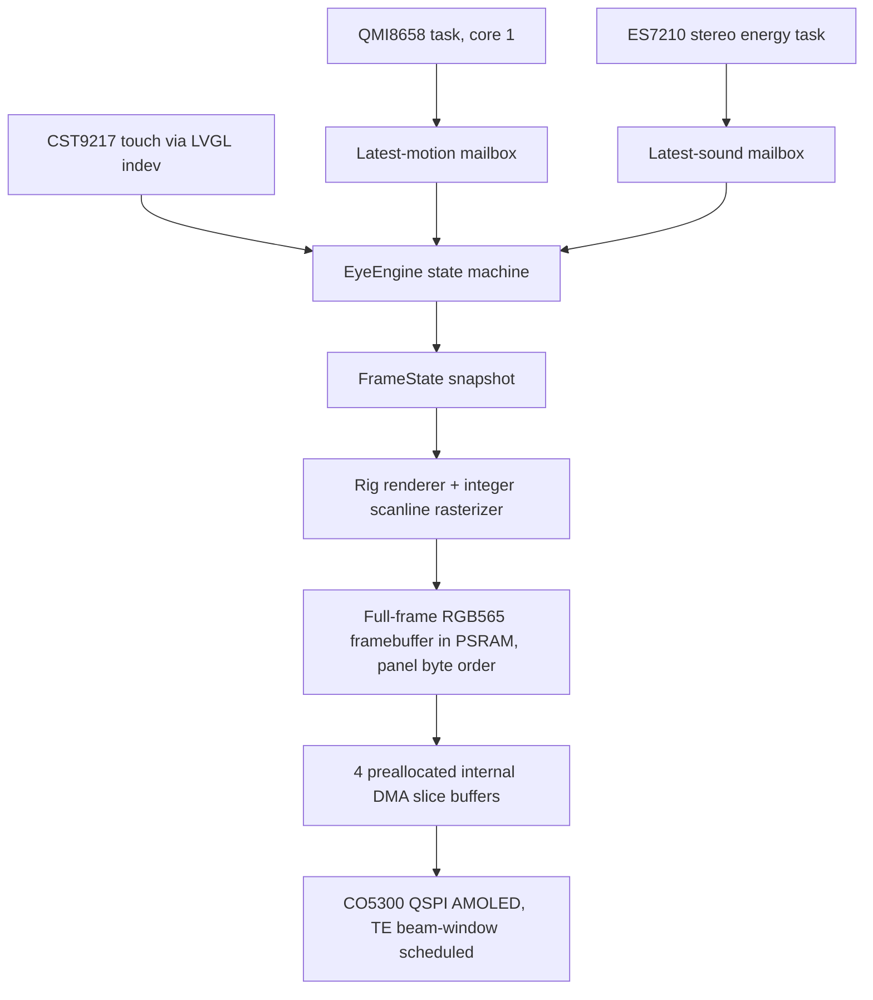

# Firmware architecture

The project separates deterministic behavior and rendering from ESP-IDF integration. The same engine and rasterizer compile on the host (golden tests, previews) and on Xtensa.

## Components

| Component | Responsibility |
|---|---|
| `catalog.cpp` | Exact 4-state and 100-palette catalog; wraparound selection |
| `eye_engine.cpp` | Input arbitration, blink/flourish schedules, dual-rate gaze LPFs, shape-morph weights, browse drag/settle, reactions; nothing user-visible snaps |
| `raster.cpp` | Allocation-free integer scanline rasterizer: edge tables, difference-array AA coverage, solid-run fills, per-row span clipping (2 runs/row), path opacity, diff-clear row runs |
| `eye_renderer.cpp` | Rig sampling (dual gaze), additive clip layers (idle, pupil loops, rot flourishes, gaze-anchored blink), hex fisheye grid with collision relaxation and pan-idle incremental repaint, motion-adaptive AA |
| `imu_service.cpp` | QMI8658 setup, polling, calibration and latest-sample delivery |
| `preferences.cpp` | NVS selection and calibration persistence |
| `app_main.cpp` | BSP lifecycle, TE ISR + beam-window write scheduling, slice-buffer band blits, framebuffer text overlays (selection + debug stats), buttons, timers |

## Display pipeline (no LVGL rendering)

- The LVGL adapter runs in **dummy-draw mode** permanently: LVGL supplies touch input and timers only; all pixels go framebuffer -> panel directly.
- The TE line (GPIO13) is measured live: ~16.9 ms period, ~628 us blank. Band writes start only in provably beam-safe windows (beam above the band, or past it with wrap margin); the 80 MHz QSPI write outruns the 28.5 rows/ms scan, so a single-GRAM panel renders tear-free.
- Bands stream through 4 preallocated 16-row internal DMA buffers (the SPI driver's per-chunk PSRAM bounce allocation fragments the heap and truncates transfers — never DMA from PSRAM here).
- Text overlays (selection info, BOOT-hold-3s debug stats) draw into the framebuffer with an embedded 8x8 font.
- Telemetry every 2 s: fps, render/wait/blit, per-phase render times, measured TE period.

## Render pipeline

- Hero frames diff-clear: per-row covered runs from the previous frame are erased lazily as rows repaint (pixel-exact vs full clear, proven by test).
- Antialiasing: 8 vertical subsamples at rest, 4 in motion, 2 for small grid cells; coverage kept as a difference array prefix-summed in the blend pass.
- Grid: hex torus (10x10 palettes, 4 shapes hashed per cell), analytic fisheye with 1.9x center boost + pairwise collision relaxation, ~8 inner cells animated statelessly (hash-derived phases), pan-idle frames repaint animated cells only.
- Rendering and transfer run serially in the LVGL task by measurement: two pipelined architectures lost to PSRAM contention and tick quantization.

## Task model

- LVGL task (core 0, pinned): engine tick at 16 ms, render, TE wait, blit, buttons.
- IMU task (core 1) ~8 ms poll; length-one latest-motion mailbox; separate reliable calibration queue.
- Audio task: 16 kHz stereo capture, 20 ms energy windows, length-one mailbox.
- NVS writes only on settle/calibration.

